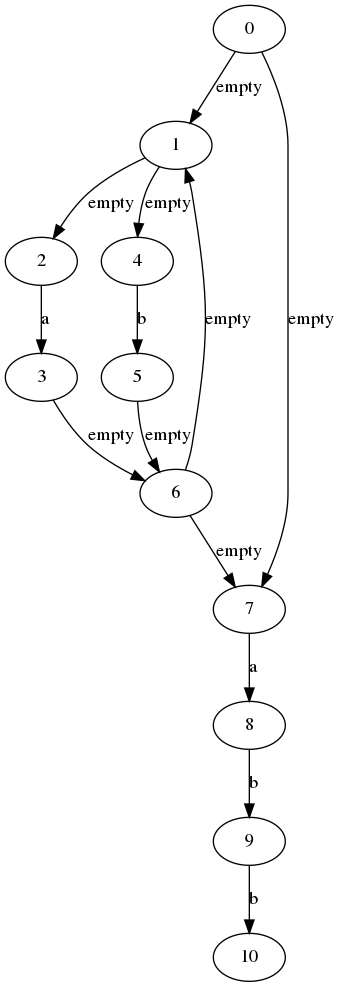
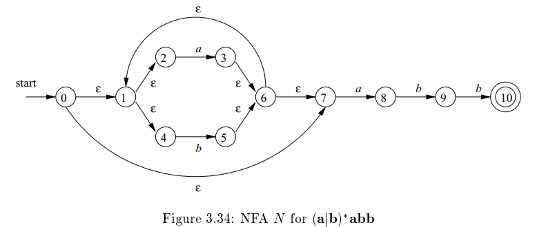
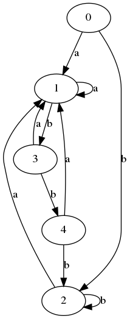
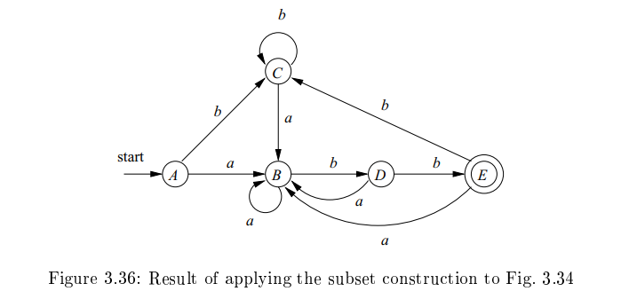

## finite automata helper

简单的搞一下编译原理的 nfa dfa lex 之类的作业咯

#### 目前已经有的功能

现在还是残废版本

1.  fa 可视化，基于 networkx, pydot, graphviz
1.  nfa 转 dfa
1.  简单的stdin

#### 目前还没有的功能

开了很多坑，慢慢填

1.  初态和终态的可视化
1.  dfa 最简化
1.  re 和 dfa 之间的转化
2.  把 empty 替换为 $\epsilon$
3.  多种节点label
4.  layout 整好看点（可能太难了，[Graph Editor](https://csacademy.com/app/graph_editor/) 是我知道的最优解
5.  可能还是 WA 的，没有经过很多 test case 验证

#### Example

+ 样例来自 Compiler Principle P155 Fig 3.34, Fig 3.36
+ 第一行输入字符集
+ 第二行一个数字代表边数 $m$
+ 之后 $m$ 行每行三个字符串 $a,b,c$ 分别代表从 $a$ 到 $b$ 一条字符为 $c$ 的有向边
+ 之后两行分别代表初态和终态

```text
a b
13
0 1 empty
1 2 empty
1 4 empty
2 3 a
4 5 b
3 6 empty
5 6 empty
6 7 empty
7 8 a
8 9 b
9 10 b
0 7 empty
6 1 empty
0
10
```

`play.py`

```python
import nfa
def readNFA():
    f = open("./in.txt", "r")
    sigma = f.readline().split()
    m = int(f.readline())
    n = nfa.NFA(sigma)
    for i in range(m):
        a, b, c = f.readline().split()
        n.add_edge(a, b, c)
    init_list = f.readline().split()
    n.set_init_state_from(init_list)
    final_list = f.readline().split()
    n.set_final_state_from(final_list)
    return n

n = readNFA()
n.draw_graphviz()
print(n.eps_closure(['0']))
f = n.toDFA()
f.draw_graphviz()
```






